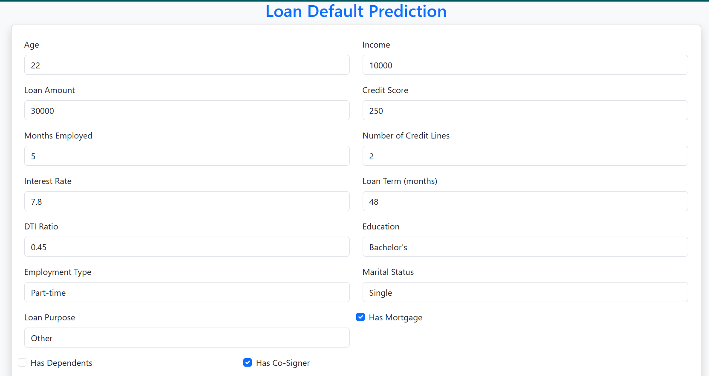

# Project Overview: Loan Default Prediction System

## Problem Statement

Banks and financial institutions face a significant challenge in minimizing loan defaults while ensuring responsible lending practices. Loan defaults occur when borrowers fail to repay their loans, causing financial losses and impacting the stability of the institution.

Identifying potential defaulters beforehand enables financial institutions to take precautionary measures and reduce risk. The challenge is to develop a reliable and efficient system to predict loan defaults based on applicant information such as income, credit score, employment type, and other key features.

## Project Workflow
The workflow of this project consists of the following key stages:

### 📊 1. Data Acquisition & Understanding

Collected the dataset from Kaggle, containing records of loan applicants with features such as:

Applicant’s age, income, credit score, loan amount, etc.
Loan status indicating whether the borrower defaulted or not.

Performed Exploratory Data Analysis (EDA) to uncover trends, relationships, and data inconsistencies.

🔎 2. Data Preprocessing & Feature Engineering:

Handled missing values and outliers for numerical and categorical columns.

Encoded categorical variables using custom mappings to ensure consistency with the model.

Created new features:

Loan-to-Income Ratio (LTI): Ratio of loan amount to applicant’s income.

Risk Score: A derived metric combining credit score, interest rate, and DTI ratio.

Standardized numerical features using a Scaler to normalize data for better model performance.

🧠 3. Model Development & Evaluation:
Trained a Random Forest Classifier (RF) due to its high accuracy and robustness with tabular data.

Applied RandomSearchCV for hyperparameter tuning, achieving an optimized model with:
Accuracy: 88.6%
Precision, Recall, and F1 Score: Evaluated to balance model performance.

Saved the final model as best_rf.joblib and the scaler as scaler.joblib for deployment.
You can download the trained model & scaler file from the google drive.. 
https://drive.google.com/drive/folders/1bCGcFLm0Xgf3czPF2WqcrHnsVmaBT8Qm?usp=sharing

### 🌐 4. Flask Web Application

Built a Flask Web App where users can enter loan application details and get predictions.

Integrated a feature to save predictions into predicted.csv with a unique LoanID generated for each record.

Flask app includes:

/ → Home route for form submission and displaying prediction.

/predict → API endpoint for receiving data and returning predictions.

### 5. API Development:

Developed an API using Flask to enable real-time predictions with:

Form Input: Accepting data via HTML form submission.

Direct API Requests: Accepting JSON data to the API endpoint.

API returns predictions in JSON format, making it suitable for integration with other platforms.

### 📊 6. Power BI Dashboard for Insights
Created a Power BI Dashboard to visualize:

Loan performance metrics (default rates, approval trends).

User prediction history from predicted.csv.

Real-time data updates as new records are added.

Integrated key KPIs and visualizations to provide actionable insights.

## 📊 Dataset Overview: Loan Default CSV

| **Feature Name**      | **Description**                                                                 |
|----------------------|---------------------------------------------------------------------------------|
| `LoanID`              | Unique identifier for each loan application                                   |
| `Age`                 | Age of the applicant                                                           |
| `Income`              | Annual income of the applicant                                                 |
| `LoanAmount`          | Loan amount requested by the applicant                                         |
| `CreditScore`         | Credit score of the applicant                                                   |
| `MonthsEmployed`      | Number of months the applicant has been employed                               |
| `NumCreditLines`      | Number of existing credit lines                                                 |
| `InterestRate`        | Interest rate applied on the loan                                               |
| `LoanTerm`            | Loan term duration in months/years                                              |
| `DTIRatio`            | Debt-to-Income Ratio (DTI) of the applicant                                     |
| `Education`           | Educational qualification (e.g., Bachelor’s, Master’s, etc.)                   |
| `EmploymentType`      | Employment status (Full-time, Part-time, etc.)                                  |
| `MaritalStatus`       | Marital status (Single, Married, Divorced, etc.)                                |
| `HasMortgage`         | Indicates if the applicant has an existing mortgage (1 = Yes, 0 = No)           |
| `HasDependents`       | Indicates if the applicant has dependents (1 = Yes, 0 = No)                     |
| `LoanPurpose`         | Purpose of the loan (Auto, Home, Business, etc.)                                |
| `HasCoSigner`         | Indicates if there is a co-signer for the loan (1 = Yes, 0 = No)                |
| `Default`             | Target variable indicating loan status (1 = Default, 0 = No Default)            |

## 🔎 Exploratory Data Analysis (EDA) Insights

###  Insight 1: Credit Score and Default Probability

- Defaulters (1) have a lower median credit score compared to non-defaulters (0).
- IQR for defaulters is lower (~400–600), while non-defaulters show higher median scores (~600).
- Conclusion: Lower credit scores significantly increase the likelihood of default.

---

###  Insight 2: Loan Amount and Default Correlation

- Higher loan amounts are directly linked to increased chances of default.
---

###  Insight 3: Employment Status and Default Risk

- Unemployed applicants have the highest default probability.
---

###  Insight 4: Income Level Impact

- Low-income borrowers are more prone to default.
---

###  Insight 5: DTI Ratio and Default

- Defaulters show significantly higher DTI ratios, confirming its relevance.
---

###  Insight 6: Risk Score as a Key Feature

- Higher Risk Scores (calculated as `CreditScore / DTIRatio`) correlate with more defaults.
- A visible rightward shift in the risk curve for defaulters highlights this pattern.

---

###  Label Encoding Categorical Features

- `Education`: Bachelor's = 0, High School = 1, Master's = 2  
- `Employment Type`: Full-time = 0, Part-time = 1, Self-employed = 2, Unemployed = 3  
- `Marital Status`: Divorced = 0, Married = 1, Single = 2  
- `Loan Purpose`: Auto = 0, Business = 1, Education = 2, Home = 3, Other = 4  

---

###  Class Imbalance & SMOTE Application

- **Observation:** Class 0 (Non-defaulters) - 225,694, Class 1 (Defaulters) - 29,653.  
- The dataset is imbalanced (~11.6% default rate), leading to biased predictions.  
- **Solution:** Applied **SMOTE** to create synthetic samples and balance the dataset.

## 🌐 Flask Web Application & API

###  Overview
Our Flask application provides an intuitive interface for loan default prediction and includes a robust API for external use. It performs the following tasks:

- Accepts user input via a web form.
- Preprocesses and scales the input using pre-trained scalers.
- Predicts loan default status using a trained Random Forest model (`best_rf.joblib`).
- Saves the prediction and input data to `predicted.csv` for future analysis.

---

###  Key Functionalities
1. **Preprocessing User Data:**  
   - Categorical encoding for features like `Education`, `Employment Type`, etc.
   - Derived features:  
     - `LTI = LoanAmount / Income`  
     - `RiskScore = (CreditScore / InterestRate) * DTIRatio`  

2. **Prediction Logic:**  
   - Model predicts whether a loan will default (`1`) or not (`0`).
   - Saves user input and prediction to `predicted.csv` with a unique `LoanID`.

3. **API Functionality:**  
   - Easily integrates with external services to retrieve predictions.
---

### 📄 API Endpoints
- **`/`**: Displays the web interface to input loan details.
- **`/predict`**: Accepts POST requests with loan data and returns a JSON response with the prediction.

---

### 📊 Predicted Data Storage
- `predicted.csv` dynamically updates as new data is added through the Flask app.
- This file is also integrated into the Power BI dashboard for real-time insights.

---

### 📝 Future Enhancements
- Add JWT-based authentication for secure API access.
- Implement user session tracking to enhance personalized recommendations.

## 📊 Power BI Dashboard

### Objective
The Power BI dashboard visualizes key metrics and insights from the loan default analysis. It seamlessly integrates the `predicted.csv` file generated by the Flask app to keep the data updated with new predictions.

---

### Key Features
1. **Loan Default Summary:**  
   - Total number of loans.
   - Percentage of defaulters and non-defaulters.

2. **Credit Score Analysis:**  
   - Distribution of credit scores among defaulters vs. non-defaulters.
   - Median credit score comparison.

3. **Loan Amount Insights:**  
   - Relation between loan amount and default likelihood.
   - Higher loan amounts show increased default risk.

4. **DTI & Risk Score Distribution:**  
   - Defaulters have significantly higher DTI ratios.
   - Risk Score metric highlights high-risk borrowers.

5. **Employment & Income Impact:**  
   - Employment status and income categories analyzed to assess default risk.

---

### Dynamic Data Integration
- **Predicted Data Updates:**  
   - The `predicted.csv` file automatically updates in the Power BI dashboard as new predictions are made, ensuring real-time insights.

---

###  Additional Visuals
- Loan Purpose Breakdown
- Impact of Marital Status on Defaults
- Feature Importance from Model Results

 **Future Scope:**
- Implement time-series analysis to predict future loan default trends.
- Add geolocation data to analyze region-wise default patterns.

